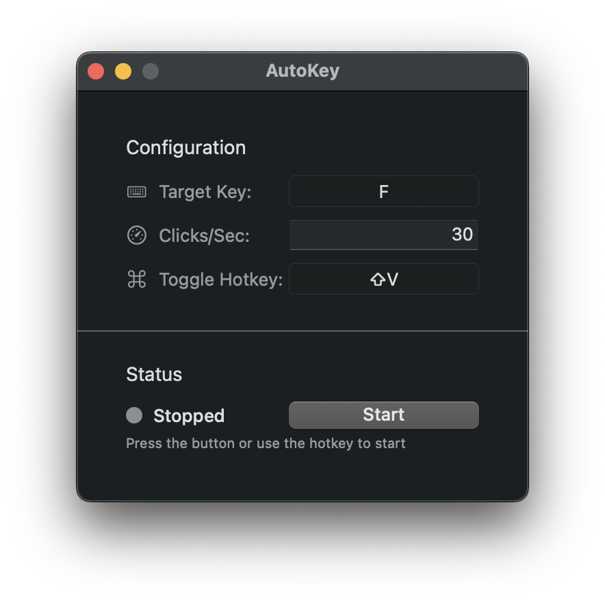

# AutoKey - [DOWNLOAD](https://github.com/ohio0987654321/AutoKey/releases/tag/1.0.0)

AutoKey is a lightweight macOS application that simulates keyboard input at configurable intervals. It's designed for automating repetitive key presses in applications, games, or any scenario where continuous keyboard input is needed.



## Requirements

- macOS 13.0 or later
- Accessibility permissions (required for key simulation and global hotkeys)

## Installation

1. Download the latest release from the [Releases](https://github.com/ohio0987654321/AutoKey/releases/tag/1.0.0) page
2. Move `AutoKey.app` to your Applications folder
3. Launch AutoKey
4. Grant accessibility permissions when prompted

## Usage

### Basic Setup

1. **Configure Target Key**: Select the key you want to simulate
2. **Set Modifiers**: Optionally add modifier keys (⌘, ⌥, ⇧, ⌃)
3. **Adjust Speed**: Set the clicks per second (1-99)
4. **Configure Toggle Hotkey**: Set a global hotkey to start/stop simulation

### Starting/Stopping Simulation

You can toggle key simulation in several ways:
- Click the "Start/Stop" button in the main window
- Use your configured global hotkey from anywhere
- Use the status bar menu

### Permissions

AutoKey requires accessibility permissions to:
- Register global hotkeys
- Simulate keyboard input
- Function properly in the background

If permissions are not granted, you'll be prompted to enable them in System Settings.

## Building from Source

### Prerequisites

- Xcode 14.0 or later
- Swift 5.9 or later
- macOS 13.0 or later SDK

### Build Steps

1. Clone the repository:
   ```
   git clone https://github.com/ohio0987654321/AutoKey.git
   cd AutoKey
   ```

2. Build using Swift Package Manager:
   ```
   make build
   ```

3. Or build and package as .app bundle with DMG:
   ```
   make release
   ```

4. The built app will be available at `.build/AutoKey.app`

## License

This project is licensed under the GNU General Public License v2.0 - see the [LICENSE](LICENSE) file for details.

## Acknowledgments

- Built with Swift and AppKit
- Uses Carbon APIs for global hotkey registration
- Accessibility features powered by macOS Accessibility framework
